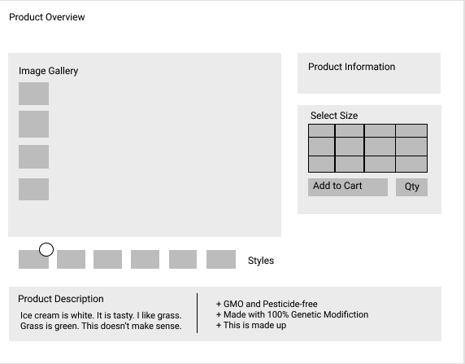

## Fashion Unit - Product Overview Module


### About
*Fashion House* is an e-commerce retail web-portal that aims to allow users to shop for clothing items. This single page application displays product detail page with four main modules

* [Product Overview](#overview)
* [Ratings & reviews](#ratings)
* [Questions & Answers](#qna)
* [Related Items & Outfit Creation](#related)

I was responsible for building the front end infrastructure for Product Overview Module.


### Tech Stack
*Fashion House* was primarily built with ReactJS on the front end and Node/Express on the backend. Other key technologies used are listed below:

* HTML
* CSS
* Javascript
* React
* React Router
* Axios
* Jest
* Enzyme
* CircleCI
* ESLint (AirBnB Style Guide)
* Babel
* Webpack
* Node
* Express

### Wireframe for  Product Overview Module

I was responsible for Product Overview Module. Here's my attempt at



### Minimum Viable Product - Product Overview

#### User stories

* User should be able to view all the styles available for a specific product id.
* User should be able to select a specific style by clicking on it.
* User should then be able to view all the images available corresponding to a specific style.
* User should be able to browse between and zoom in on these photos in the image gallery.
* User should also be view the images in default and expanded view.
* User should be able to view product information such as product description, style name, product name, price corresponding to the specific style.
* User should be able to select a size.
* User should be able to select quantity.
* User should be able to add the product, size and quantity to the cart.


### Getting started
1. Once you clone the repo, from the root directory run
   ```sh
     npm install
   ```
2. You will need a gihub personal access token to access our API. Please create a file called 'token.js' at the root directory and copy and paste the following code in the newly created file:
   ```sh
     const token = <YOUR ACCESS TOKEN>;

     module.exports = token;

3. To compile, from the root directory run
   ```sh
	 npx webpack
	 ```
4. To start server (default port 3000)
   ```sh
	 node server/server.js
	 ```
5. Navigate your browser to `localhost:3000/products/:product_id` (for the :product_id try 23175)

### Git Workflow

Our team utilized the Git workflow. The master branch contained our working code, and work on individual features were done on separate branch.

We also used followed Agile workflow with Trello to keep track of our tickets. We held daily morning standups to track the progress made by each engineer and updated our tickets accordingly.

### Modules
The _product detail page_ consists of four distinct modules:

#### <a name="overview">Product Overview</a>

The overview module is the top-most module on the Product Detail page. The main functionality contained within this module can be divided into several pieces:

* Image Gallery
* Product Information
* Style Selector
* Add to Cart

#### <a name="ratings">Ratings & Reviews</a>

The Ratings & Reviews module will allow viewing and submission of reviews for the product selected.  The functionality contained within this module can be divided into several pieces:
* Write new review
* Reviews List
* Sorting
* Rating Breakdown
* Product Breakdown

#### <a name="qna">Questions & Answers</a>

The Questions & Answers module will allow asking and answering of questions for the product selected.  The functionality contained within this module can be divided into several pieces:
* View questions
* Search for a question
* Asking a question
* Answering a question

#### <a name="related">Related Items & Outfit Creation</a>

The Related Items & Comparison Module displays two sets of related products. The first set will be a list of products, determined internally, that are related to the product currently being viewed.  The second set will be a list, custom created by the user, of products which the user has grouped with the current product into an ‘outfit’.

* Related Product Cards
* List Behavior
* Related Product List

Please learn more about the overall project and contibutors here:
https://github.com/7-Oscillating-Owls/hoo-dunit

Contributors [Ankur Tandan](https://github.com/agentanky), [Kanchan Chauhan](https://github.com/kc127), [Monica Bui](https://github.com/moneycabui), [Philip Ho](https://github.com/phil-ho)

